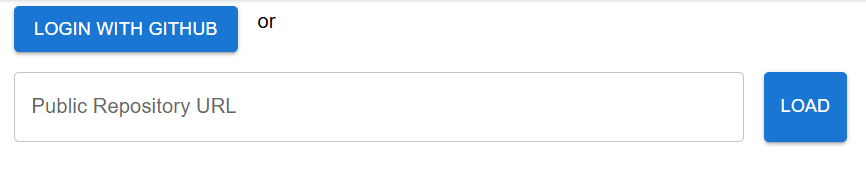
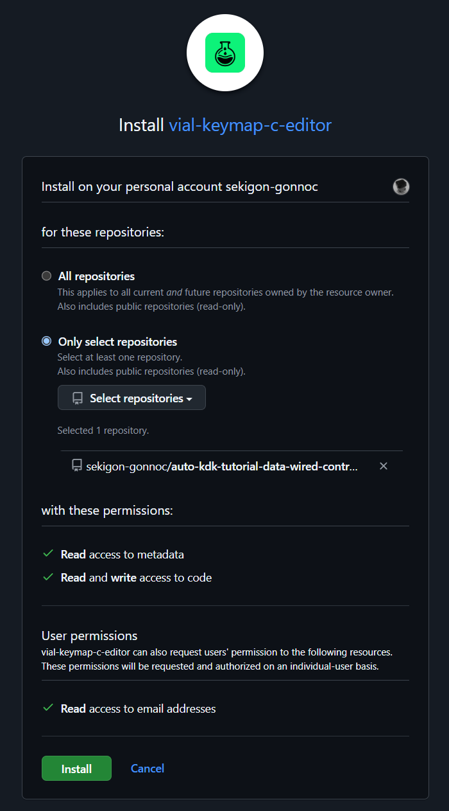
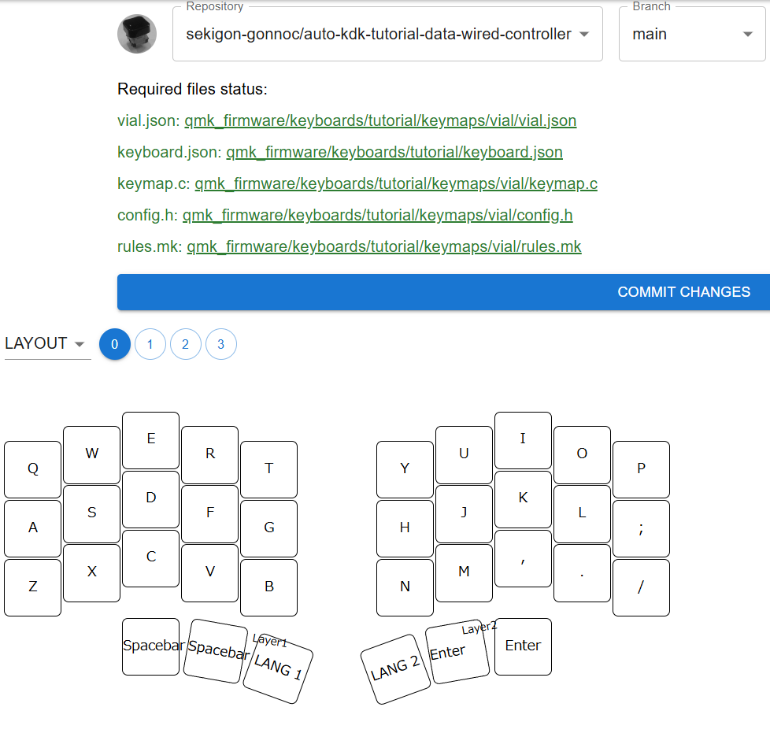

# vial-keymap-c-editor

<a href="https://vial-keymap-c-editor.pages.dev/" target="_blank"></img></a>
https://vial-keymap-c-editor.pages.dev/

vialの初期キーマップをGUIから設定するためのツールです。 GitHubとの連携を許可することでkeymap.cを読みこみ、編集した結果をコミットできます。

対象リポジトリのファイル構成は下記のようにしてください。
[サンプルはこちらです。](https://github.com/sekigon-gonnoc/auto-kdk-tutorial-data-wired-controller)  

[`.github/workflow/build.yml`](https://github.com/sekigon-gonnoc/auto-kdk-tutorial-data-wired-controller/blob/main/.github/workflows/build.yml)と[`target.json`](https://github.com/sekigon-gonnoc/auto-kdk-tutorial-data-wired-controller/blob/main/target.json)は編集したキーマップをGitHub Actionsでビルドするための設定です。

```
.github/
└── workflows/
    └── build.yml (optional)
target.json (optional)
qmk_firmware/
└── keyboards/
    └── <your-keyboard>/
        ├── keyboard.json
        └── keymaps/
            └── vial/
                ├── config.h
                ├── keymap.c
                └── rules.mk
```

> [!warning]
> 1つのリポジトリあたりのキーボード/キーマップは1つだけにしてください。  
> 複数のキーボードやキーマップを切り替えたい場合はブランチを切り替えてください。

| 機能                     | 対応状況 |
| ------------------------ | -------- |
| キーマップ               | ✔        |
| タップダンス             | ✔        |
| コンボ                   | ✔        |
| マクロ                   | ✔        |
| エンコーダ               | ✔        |
| オーバーライド           | ✔        |
| レイヤ数やコンボ数の変更 | ✔        |

## 使用方法

* `LOGIN WITH GITHUB`ボタンを押す
    
* （初回のみ）リポジトリを選択してGitHub Appをインストールして、ツールに戻る
  
* `REPOSITORY`と`BRANCH`を選択したらキーマップが表示される
  
* 編集が完了したら`COMMIT CHANGES`ボタンを押して編集内容をGitHubにコミットする

自動生成されるキーマップに手書きのコードを追加したい場合は、keymap.cの`/* USER INCLUDE BEGIN*/` および `/* USER CODE BEGIN */`で始まる部分に記入してください。

別のリポジトリを編集したい場合は`ADD REPOSITORY`ボタンを押して、GitHubの設定画面でリポジトリを追加してください。